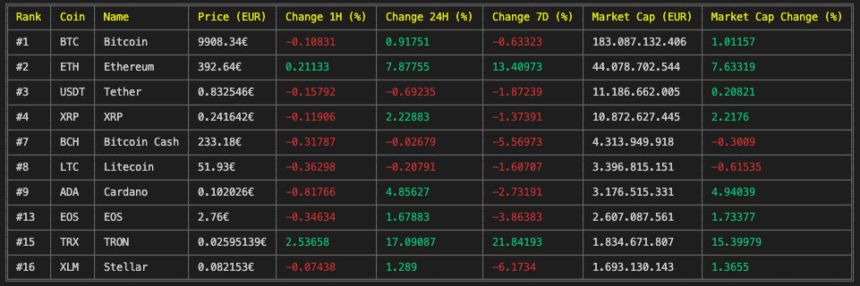

# Récupération et affichage de stats de Cryptomonnaies

Ce petit projet permet de récupérer, via l'API de **CoinGecko**, les principales informations sur des cryptomonnaies entrées en paramètre.

## Utilisation
Une fois dans le dossier racine

```node
yarn run start btc,xrp,eth,eos,bch,usdt,ltc,trx,xlm,ada 
```

## Résultat


## Fonctionnalités
* Récupère de **nombreuses informations** sur les cryptomonnaies (prix, classement, évolution du prix en %, etc).
* Affiche les résultats sous forme de table **facilement lisible** et en **couleur**.
* Actualisation toutes les **5 secondes**.
* S'adapte à la casse : rentrer `BTC` ou `btc` ne change rien.
* Entrer une cryptomonnaie inexistante ne provoque pas d'erreur.
* Les cryptomonnaies sont classées par **ordre croissant**.


## License
[MIT](https://choosealicense.com/licenses/mit/)
